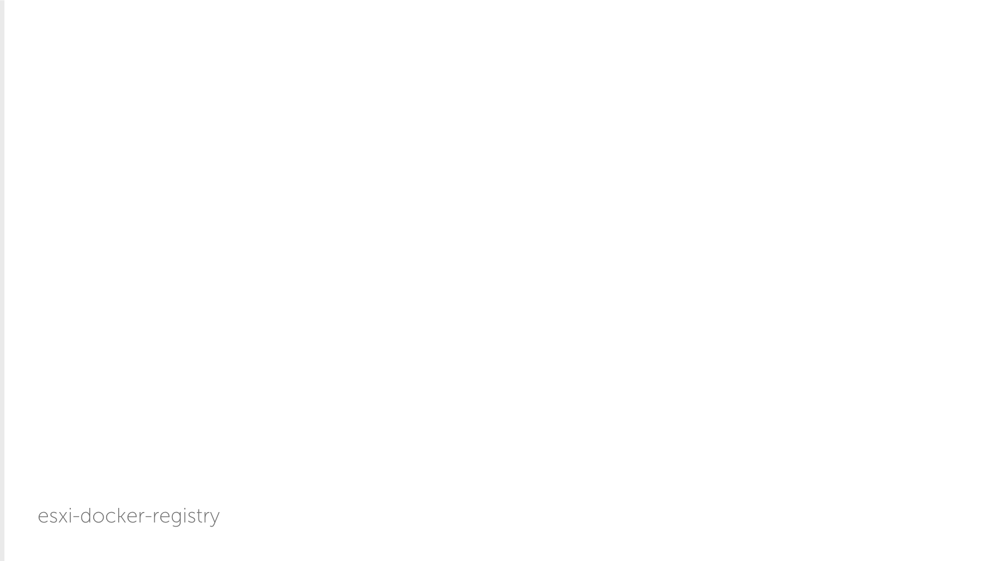

# esxi-docker-registry

> Terraforms for a local Docker Registry on ESXi

## Requirements

gnu make (Not "really" required, but will allow you to make use of the `make`
commands linked to `.tf.makefile`. This is really only for Mac OS users) *Note,
you can of course write out your own terraform plan/apply/destroy commands.*

Terraform  
ESXi and VCSA (tested on ESXi 6.5u2 and VCSA 6.7)  
Domain name for the registry  
SSL certs

__VM Template__

This is uses [CoreOS](https://coreos.com) and a CoreOS template will need to be
created. The name of the template should be named `coreos-stable`. *The name of
the template could be named according to your needs, be sure to update the
`variables.tf` to reflect the proper template name.*

## Setup

    make init:root

This will bootstrap the terraform plugins and copy over the `tfvars` templates
used to configure the terraforms. *You can of course edit the `provider.tf` &
`variables.tf` directly if you wish.*

### Create your SSH keys

    make ssh-keygen

### SSL certs

I've used [letsencrypt](https://letsencrypt.org), and the generated
`fullchain.pem` and `privkey.pem` should be copied over to the `ssl/` directory.

If you are using another provider or self-signed please be sure to name them to
the letsencrypt equivalents noted above. *If you do not wish to rename, you will
need to update the `vm.tf`'s `provisioner` section for the correct filenames.*

### Edit the `.tfvars`

Edit the `.provider.tfvars` and the `.variables.tfvars` with your
configurations.

### Backend

This comes with a `backend.tf.sample` file which should be renamed to
`backend.tf` if you wish to use it and assigned with your desired backend setup.
*This is optional and can be skipped.*

## Deploying

    make tf:plan

To test/create your plan.

    make tf:apply

To apply your created plan.

    make tf:apply!

Appeding the `!` will automatically replan before applying.

### SSH

    make ssh

Will read the `ipv4_address` output from terraform and setup your SSH command.
*Note the username is `core`.*

You can of course run your own command such as

    ssh -i .ssh/id_rsa core@<ipv4_address>

## Destroying

    make tf:destroy

Will run the `terraform destroy` command. *The make command has an extra key
confirmation just to ensure this is really what you want to do.*

---

### TODO

- [ ] Create volume to for reattachable registry folder to allow rebuilding of
the vm without registry data loss.
